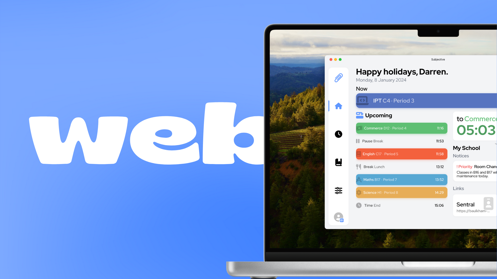

**Subjective for Web is available today** for all students either in our new library of 17 schools at launch (with more to come), or through a custom school.

Thanks for your support, from SchoolScout to Subjective. :)

**Available free, at [app.subjective.school](https://app.subjective.school)**

**Join the [Subjective Community on Discord](https://discord.subjective.school)**

Subjective for iOS will feature the new comprehensive collection of schools in a future update. 